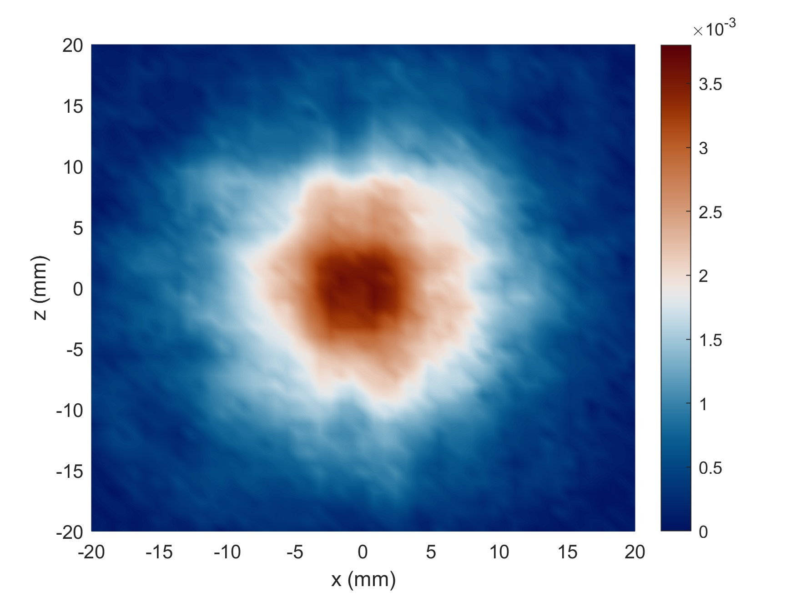
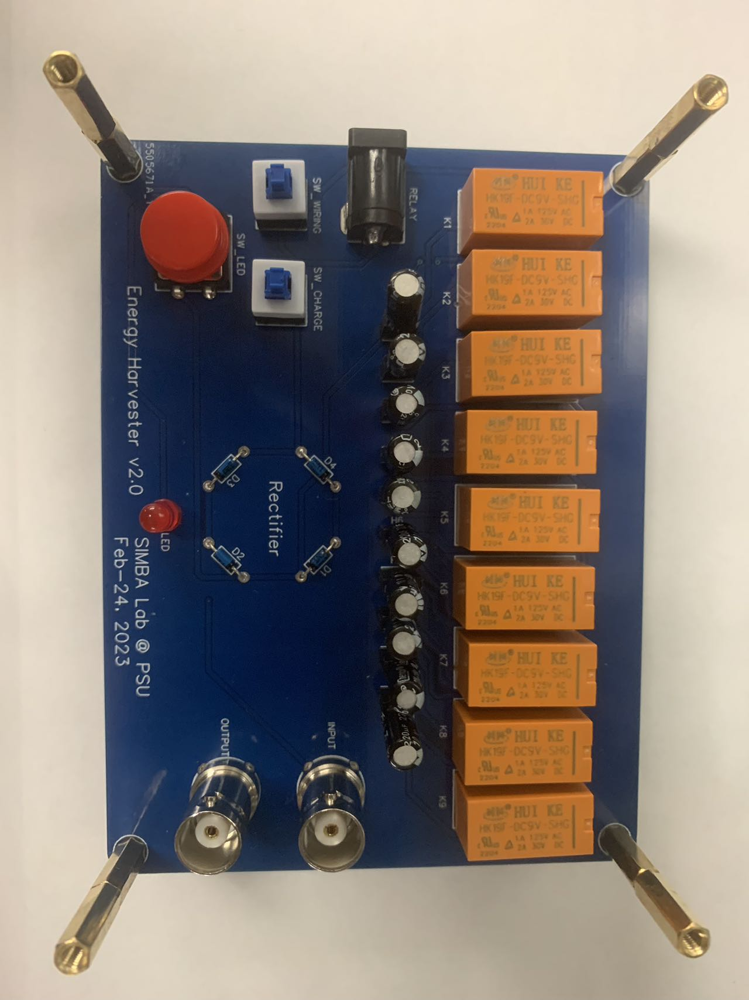

# UnderwaterMeta2302
This repo stores the data for the project `Enhancing underwater power transmission using metamaterials`.

## File trees
```
├─manuscript    // For manuscripts
├─matlab        // MATLAB files
└─rep           // Other reports
    ├─ExpNotes  // Experimental notes
```

## MATLAB files
Run `UnderwaterMeta2302.m` at first to include the paths.

## Important figures

### Measurements
Power transmission coefficients with and without the AMM. See `matlab/exp/CalPowTransCoef_230302C_Res.m`.


Pressure distribution in the xy plane without AMM and plate at 445 kHz.
Generated by `CalPowTransCoef_230302C_PrsVoid.m`.


Pressure distribution in the xy plane **with AMM** at 445 kHz.
Generated by `CalPowTransCoef_230302C_PrsAMM.m`.



Pressure distribution in the xy plane **with plate** at 445 kHz.
Generated by `CalPowTransCoef_230302C_PrsPlate.m`.


Pressure distribution in the xz plane without AMM and plate at 445 kHz.
Generated by `AnalyzeData_Horizon_230227D_Exp230223B_Void.m`.


Pressure distribution in the xz plane **with AMM** at 445 kHz.
Generated by `AnalyzeData_Horizon_230227D_Exp230227B_AMM.m`.


Pressure distribution in the xz plane **with plate** at 445 kHz.
Generated by `AnalyzeData_Horizon_230227D_Exp230303A_Plate.m`.


### PCB
Schematic diagram of the PCB. 
See `Schematic_EnergyHarverster2302223A.pdf`.


Top layer of the PCB.


Bottom layer of the PCB.


3D rendering of the PCB.


Photo of the PCB



Circuit for the charging.
Raw file is `fig/FullBridgeRectifier/FullBridgeRectifier.pdf`.
